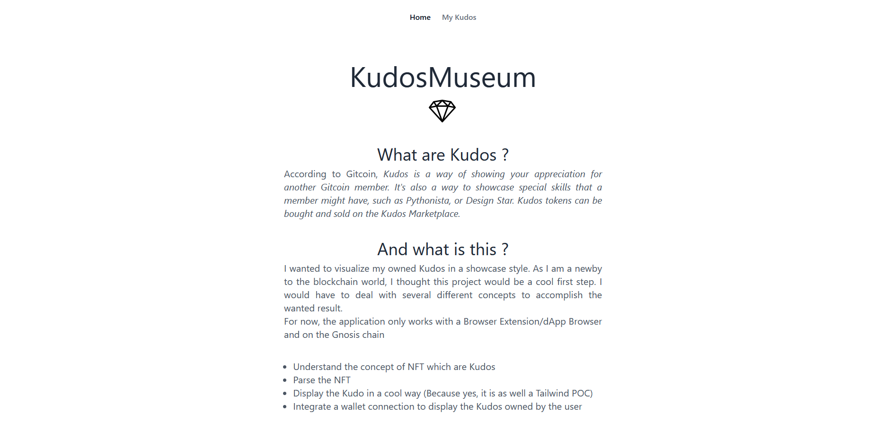
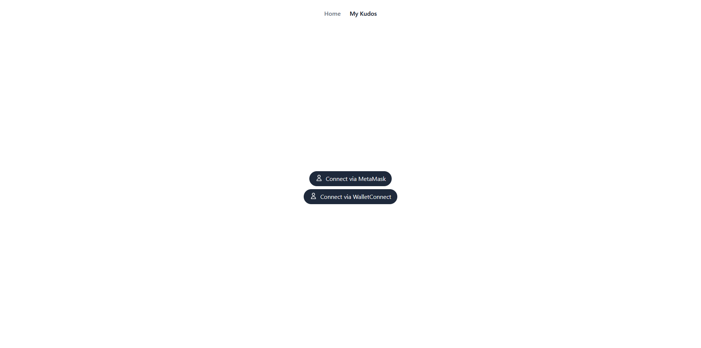
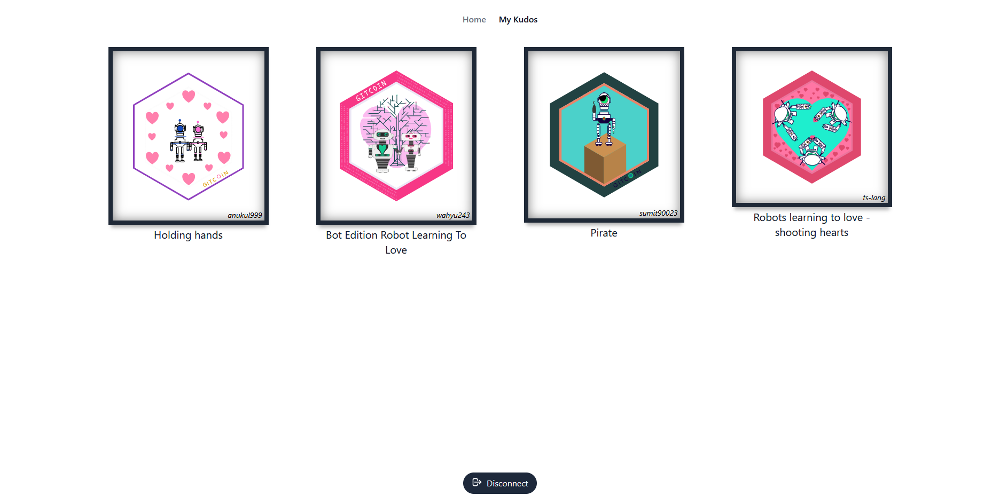

## Librairies

<div id="top"></div>

[](https://app.netlify.com/sites/loving-morse-6e560a/deploys)

<!-- PROJECT LOGO -->
<br />
<div align="center">
  <a href="https://github.com/github_username/repo_name">
    
  </a>

<h3 align="center">KudosMuseum</h3>

  <p align="center">
    Visualize your Kudos as in a Gallery.
    <br />
    <a href="https://github.com/mathieukh/KudosMuseum/issues">Report Bug</a>
    ·
    <a href="https://github.com/mathieukh/KudosMuseum/issues">Request Feature</a>
  </p>
</div>

<!-- TABLE OF CONTENTS -->
<details>
  <summary>Table of Contents</summary>
  <ol>
    <li>
      <a href="#about-the-project">About The Project</a>
      <ul>
        <li><a href="#built-with">Built With</a></li>
      </ul>
    </li>
    <li>
      <a href="#getting-started">Getting Started</a>
      <ul>
        <li><a href="#prerequisites">Prerequisites</a></li>
      </ul>
    </li>
    <li><a href="#roadmap">Roadmap</a></li>
  </ol>
</details>

<!-- ABOUT THE PROJECT -->

## About The Project







For now, the project only works considering with a Browser extension or via WalletConnect.

It also **only** works on the [GnosisChain](https://www.xdaichain.com/).

<p align="right">(<a href="#top">back to top</a>)</p>

### Built With

- [Ethers.js](https://docs.ethers.io/v5/)
- [Heroicons](https://heroicons.com/)
- [Next.js](https://nextjs.org/)
- [React.js](https://reactjs.org/)
- [RxJS](https://rxjs.dev/)
- [TailwindCss](https://tailwindcss.com/)
- [useNft](https://github.com/spectrexyz/use-nft)
- [useWallet](https://github.com/aragon/use-wallet)

<p align="right">(<a href="#top">back to top</a>)</p>

<!-- GETTING STARTED -->

## Getting Started

```bash
yarn dev
```

Open [http://localhost:3000](http://localhost:3000) with your browser to see the result.

### Prerequisites

```bash
yarn

or

yarn install
```

<!-- ROADMAP -->

## Roadmap

See the [open issues](https://github.com/mathieukh/KudosMuseum/issues) for a full list of proposed features (and known issues).

<p align="right">(<a href="#top">back to top</a>)</p>
